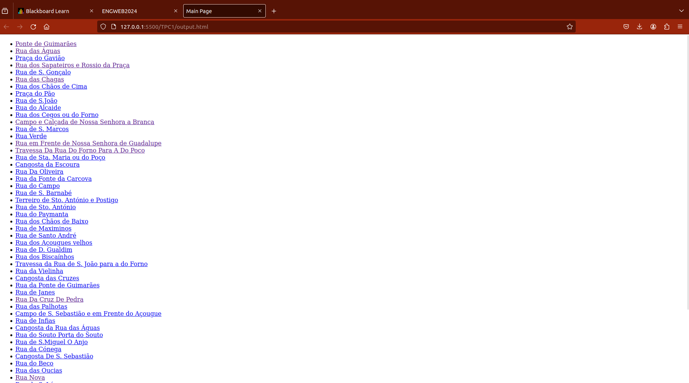
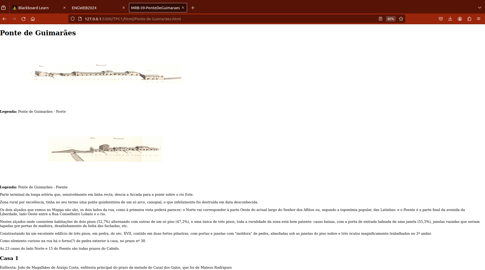
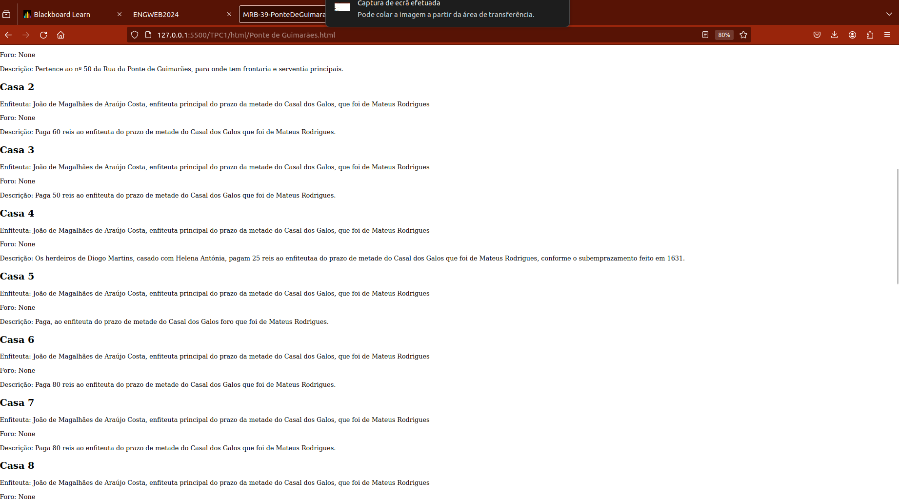
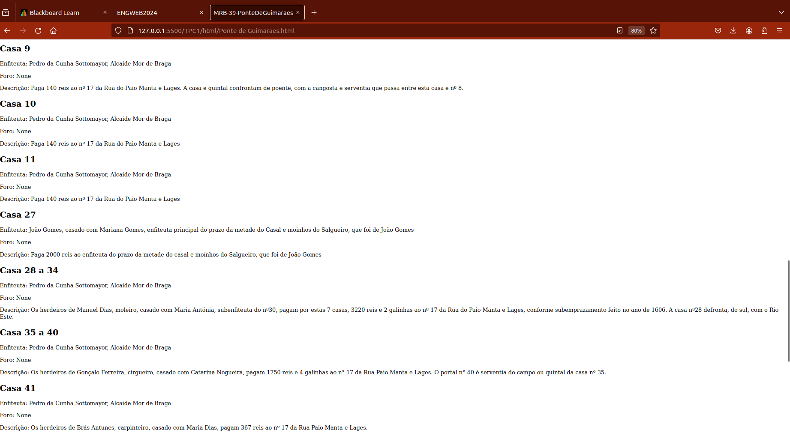
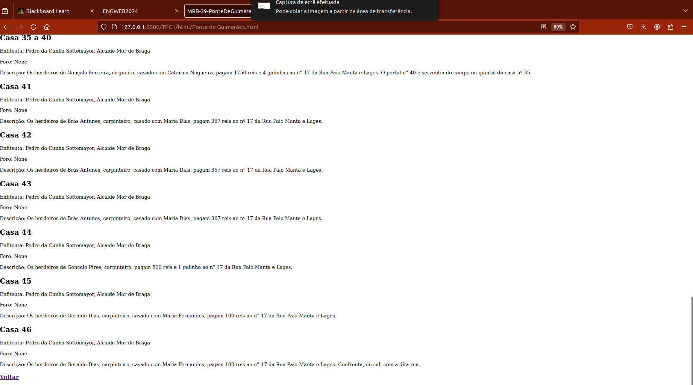

# Título 
TPC1 - Leitura de ficheiros xml e criação da lista das ruas (em html) com uma hiperligação para um html com a informação específica dessas ruas

# Data de Início
05/02/2024

# Data de Fim
10/02/2024

# Descrição
Este script Python realiza a leitura de arquivos XML, extrai informações específicas e gera páginas HTML correspondentes.

A função *parse_xml(xml_string)* recebe uma string XML, a analisa e extrai informações específicas, como número, nome, imagens, legendas, corpo, data, entidades e lista de casas. Essas informações são armazenadas em um dicionário e retornadas pela função.

Em seguida, o script verifica se uma diretoria específica (./TPC1/html) existe. Se não existir, ele é criado.

O script então inicia a criação de uma string HTML principal, que servirá como a página principal contendo links para todas as outras páginas geradas.

O script então percorre todos os arquivos XML em um diretório específico (./MapaRuas-materialBase/texto). Para cada arquivo XML, ele lê o arquivo, passa o conteúdo para a função *parse_xml(xml_string)* para extrair as informações necessárias e começa a construir uma string HTML individual para esse arquivo.

A string HTML individual inclui o nome, imagens e legendas correspondentes, parágrafos do corpo, e informações sobre 'casa' extraídas do arquivo XML. Uma vez que a string HTML individual é completa, ela é escrita em um arquivo HTML na diretoria ./TPC1/html.

Um link para a página HTML individual é então adicionado à string HTML principal.

Finalmente, após todos os arquivos XML terem sido processados, a string HTML principal é concluída e escrita em um ficheiro HTML (./TPC1/output.html), servindo como uma página de índice para todas as páginas HTML individuais geradas.

# Resultados

